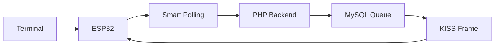

# 📡 UDM Packet Radio Internet Gateway (PRIG)

<div align="center">


*Modern Serverless Packet Radio Gateway with CB-Funk Simulation and Studio-Quality AFSK Audio*

[🚀 Features](#-features) • [📋 Installation](#-installation) • [🔧 Configuration](#-configuration) • [📖 Documentation](#-documentation)

</div>

---

## 🎯 Overview

The **UDM Packet Radio Internet Gateway (PRIG)** is a revolutionary ESP32-based solution that transforms traditional packet radio communication into a modern, serverless MQTT broadcast system. It simulates CB-Funk behavior with channel selection, encrypted payload transmission, and authentic Bell 202 AFSK audio generation.

### 🌟 Key Features

- **📻 CB-Funk Simulation**: 40-channel broadcast system mimicking classic CB radio
- **� Encrypted Payloads**: XOR encryption with shared secret for secure communication
- **🎵 Studio-Quality AFSK**: I2S audio with MAX98357A for authentic Bell 202 sound
- **🌐 Serverless Architecture**: Pure MQTT broadcast, no server dependencies
- **� Professional UI**: 7-segment CB channel display with brightness control
- **⚙️ Advanced Configuration**: Thematic web interface with live controls

---

## 🚀 Features

### � CB-Funk MQTT System
- **40 Channel Support**: CB channels 1-40 with professional 7-segment display
- **Broadcast Architecture**: Serverless MQTT topics `udmprig/rf/1` to `udmprig/rf/40`
- **HiveMQ Cloud**: SSL/TLS encrypted MQTT broker connectivity
- **Channel Switching**: Live channel selection with instant topic switching

### 🔒 Security & Encryption
- **Payload Encryption**: XOR encryption with configurable shared secret
- **EEPROM Storage**: Persistent encryption keys and configuration
- **JSON Structure**: Clean message format with encrypted payload field
- **Selective Encryption**: Only payload data encrypted, metadata readable

### 🎵 Professional AFSK Audio
- **I2S Audio Output**: MAX98357A amplifier for studio-quality sound
- **Bell 202 Standard**: Authentic 1200/2200 Hz Mark/Space frequencies
- **Phase-Continuous**: Smooth frequency transitions for clean AFSK
- **Volume Control**: 0-100% adjustable audio level
- **TX/RX Differentiation**: Frequency offset for authentic radio feel

### 🌐 Network & Connectivity
- **WiFi Management**: WPA2 with connection monitoring and auto-reconnect
- **MQTT SSL/TLS**: Secure encrypted communication to cloud broker
- **mDNS Discovery**: Easy network discovery as `udm-prig.local`
- **Web Configuration**: Responsive HTML5 interface with real-time updates

### 🖥️ Display & Interface
- **OLED Support**: SH1106G and SSD1306 displays with auto-detection
- **7-Segment CB Display**: Professional channel indication (01-40)
- **Brightness Control**: 0-100% adjustable display brightness
- **Live Status**: Real-time TX/RX indicators and connection status

### 🔧 Advanced Configuration
- **Thematic Web UI**: Grouped configuration cards for better organization
- **EEPROM Persistence**: All settings stored in non-volatile memory
- **CPU Frequency**: Performance optimization (240/160/80 MHz)
- **Debug Levels**: Comprehensive logging with HEX dumps and protocol analysis
- **Real-time Monitoring**: Live-Monitor mit erweiterten Debug-Informationen

### 🔄 OTA-System
- **GitHub Integration**: Automatische Updates direkt von GitHub-Repository
- **Version Management**: EEPROM-basierte Versionsverwaltung
- **Configurable URLs**: Flexible Repository-Konfiguration
- **Web-Interface Control**: Update-Steuerung über Web-Interface

---

## 📋 Installation

### 🔌 Hardware-Anforderungen

- **ESP32 Development Board** (z.B. ESP32-WROOM-32)
- **OLED Display** (128x64, I2C)
- **RS232 Interface** (MAX3232 oder ähnlich)
- **Packet Radio Modem** (TNC, etc.)

### 📚 Software-Anforderungen

#### ESP32 Client
- Arduino IDE 1.8.19+
- ESP32 Board Package
- Bibliotheken:
  - `WiFi` (ESP32 Core)
  - `HTTPClient` (ESP32 Core)
  - `ArduinoJson` (6.x)
  - `Adafruit_SSD1306`
  - `EEPROM` (ESP32 Core)

#### Server
- **Web Server**: Apache/Nginx mit PHP 7.4+
- **Database**: MySQL 5.7+ / MariaDB 10.3+
- **PHP Extensions**: `mysqli`, `json`, `curl`

### 🛠️ Setup-Schritte

#### 1. ESP32 Client Flash
```bash
# 1. Arduino IDE öffnen
# 2. ESP32 Board auswählen
# 3. ino/udm-prig-client.ino öffnen
# 4. WiFi-Credentials konfigurieren
# 5. Upload
```

#### 2. Server Deployment
```bash
# Files auf Web Server hochladen
scp -r * user@server:/var/www/html/udm-prig/

# Datenbank erstellen
mysql -u root -p
CREATE DATABASE if0_37988924_udmdb;
```

#### 3. Database Schema
```sql
-- Server Konfiguration
CREATE TABLE server_config (
    id INT PRIMARY KEY,
    callsign VARCHAR(32),
    loglevel INT DEFAULT 1
);
INSERT INTO server_config VALUES (1, 'PRGSRV', 1);

-- Client Liste
CREATE TABLE clients (
    id INT AUTO_INCREMENT PRIMARY KEY,
    callsign VARCHAR(32) UNIQUE,
    status ENUM('active','inactive') DEFAULT 'active'
);

-- Monitor Logs
CREATE TABLE monitor (
    id INT AUTO_INCREMENT PRIMARY KEY,
    timestamp DATETIME DEFAULT CURRENT_TIMESTAMP,
    message TEXT,
    loglevel INT DEFAULT 1
);

-- Smart-Polling Notifications
CREATE TABLE notifications (
    id INT AUTO_INCREMENT PRIMARY KEY,
    created_at TIMESTAMP DEFAULT CURRENT_TIMESTAMP,
    data TEXT,
    processed BOOLEAN DEFAULT FALSE
);

-- Admin Benutzer
CREATE TABLE admin_users (
    id INT AUTO_INCREMENT PRIMARY KEY,
    username VARCHAR(50) UNIQUE,
    password_hash VARCHAR(255)
);
```

---

## 🔧 Konfiguration

### 📡 ESP32 Client

#### WiFi & Server
```cpp
// WiFi Konfiguration
const char* ssid = "IhrWiFiName";
const char* password = "IhrWiFiPasswort";

// Server URLs
String serverURL = "https://ihr-server.com/udm-prig";
String otaURL = "https://github.com/ihr-user/repository";
```

#### Hardware Pins
```cpp
// OLED Display (I2C)
#define SCREEN_ADDRESS 0x3C
#define OLED_RESET -1

// RS232 Serial
#define RS232_RX 16
#define RS232_TX 17
#define RS232_BAUD 2400
```

### 🌐 Server

#### Datenbankverbindung (`db.php`)
```php
$server = "sql309.infinityfree.com";
$username = "if0_37988924";
$password = "ihr_db_passwort";
$database = "if0_37988924_udmdb";
```

#### Admin-Account erstellen
```bash
# Über Web-Interface: /login.php
# Standard: admin / admin (nach Login ändern!)
```

---

## 📖 Dokumentation

### 🔄 Smart-Polling System

Das revolutionäre Smart-Polling System reduziert Latenz dramatisch:

- **Adaptive Intervalle**: 500ms (aktiv) bis 2s (idle)
- **Database Notifications**: Effiziente Queue-Verwaltung
- **Ultra-fast Delivery**: Nachrichten in Sekunden statt Minuten



### 📡 AX.25/KISS Protokoll

Vollständige KISS-Implementation mit TSTHost-Kompatibilität:

```
KISS Frame Format:
[C0] [00] [AX.25 Header] [Control] [PID] [Data] [C0]
```

### 🔄 OTA Update System

GitHub-basiertes Update-System mit EEPROM-Versionsverwaltung:

1. **Version Check**: Vergleich GitHub vs. EEPROM
2. **Download**: Direkt von GitHub Repository
3. **Validation**: Firmware-Integrität prüfen
4. **Flash**: Sichere Installation
5. **Verification**: EEPROM-Update

---

## 🎛️ Nutzung

### 📱 Web-Interface

1. **Login**: `https://ihr-server.com/udm-prig/login.php`
2. **Dashboard**: Client-Status, Server-Monitor, Konfiguration
3. **Client Management**: Hinzufügen/Entfernen von Packet Radio Clients
4. **OTA Updates**: Firmware-Updates mit einem Klick

### 🖥️ Terminal Software

Kompatibel mit allen gängigen Packet Radio Terminals:
- **TSTHost** ✅
- **UISS** ✅  
- **AGW Packet Engine** ✅
- **Winlink Express** ✅

### 📊 Monitoring

Real-time Monitoring mit erweiterten Debug-Features:
- **Live Log**: Alle Systemereignisse in Echtzeit
- **HEX Dumps**: Binäre Frame-Analyse
- **KISS Decoding**: Detaillierte Protokoll-Analyse
- **Performance Metrics**: Smart-Polling Statistiken

---

## 🔬 Erweiterte Features

### 🐛 Debug System
```cpp
// Log Levels
0: ERROR   - Nur kritische Fehler
1: INFO    - Allgemeine Informationen
2: WARNING - Warnungen und wichtige Events  
3: DEBUG   - Detaillierte Debug-Informationen mit HEX-Dumps
```

### ⚡ Performance Optimierung
- **Smart Intervals**: Adaptive Polling basierend auf Aktivität
- **Database Indexing**: Optimierte Queries für schnelle Abfragen
- **Connection Pooling**: Effiziente Datenbankverbindungen
- **Binary Processing**: Direkte KISS-Frame-Verarbeitung

### 🔐 Sicherheit
- **Session Management**: Sichere Admin-Authentifizierung
- **SQL Injection Protection**: Prepared Statements
- **Input Validation**: Umfassende Eingabevalidierung
- **HTTPS Ready**: SSL/TLS Unterstützung

---

## 🤝 Beiträge

Wir freuen uns über Beiträge! Bitte beachten Sie:

1. **Fork** das Repository
2. **Branch** für Ihr Feature erstellen (`git checkout -b feature/AmazingFeature`)
3. **Commit** Ihre Änderungen (`git commit -m 'Add AmazingFeature'`)
4. **Push** zum Branch (`git push origin feature/AmazingFeature`)
5. **Pull Request** öffnen

### 🐛 Bug Reports
Nutzen Sie GitHub Issues für Bug Reports mit:
- Detaillierte Beschreibung
- Schritte zur Reproduktion
- Erwartetes vs. tatsächliches Verhalten
- System-Informationen

---

## 📞 Support

- **GitHub Issues**: Für Bugs und Feature Requests
- **Documentation**: Siehe `docs/` Verzeichnis
- **Community**: Packet Radio Forums und Discord

---

## 📜 Lizenz

Dieses Projekt steht unter der MIT Lizenz - siehe [LICENSE](LICENSE) für Details.

---

## 🙏 Danksagungen

- **Packet Radio Community** für kontinuierliches Feedback
- **ESP32 Community** für Hardware-Unterstützung  
- **Open Source Maintainers** für fantastische Bibliotheken

---

<div align="center">

**⭐ Wenn Ihnen dieses Projekt gefällt, geben Sie ihm einen Stern auf GitHub! ⭐**

*Entwickelt mit ❤️ für die Packet Radio Community*

</div>